# Reddit-Clone
Reddit clone built using Spring Boot, Spring Security with JPA Authentication, Spring Data JPA with MySQL, Spring MVC, Angular, Thymeleaf, MailTrap email platform, and TinyMCE WYSIWYG editor.

## Screenshots:

### FrontPage

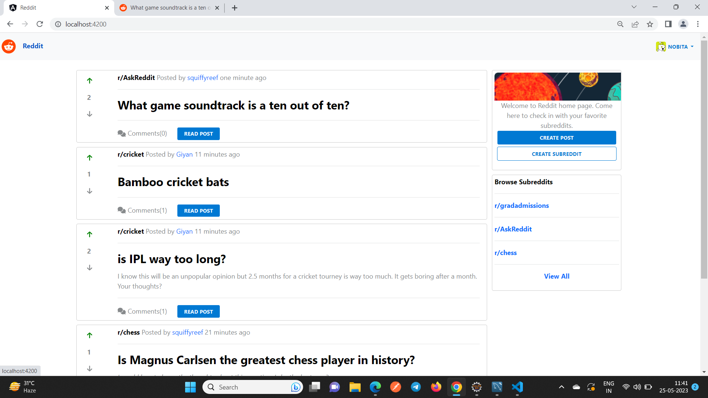

### EER Diagram

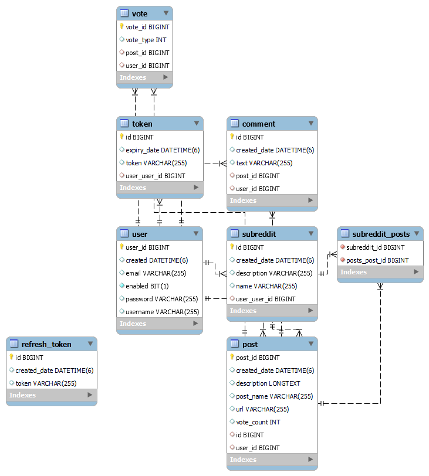

### Registration 

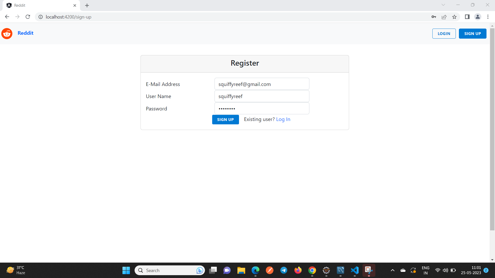

### Account Activation

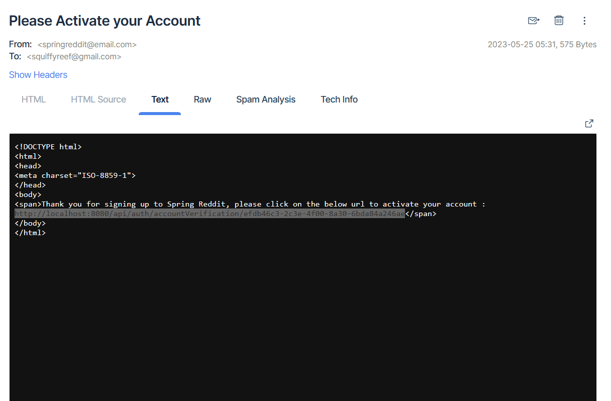

### User Login

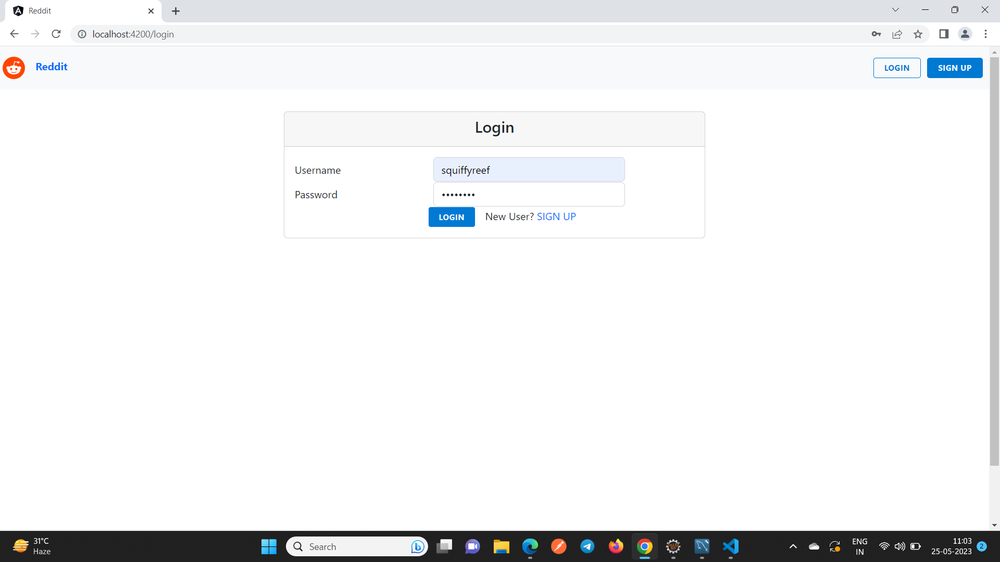

### Create Subreddit

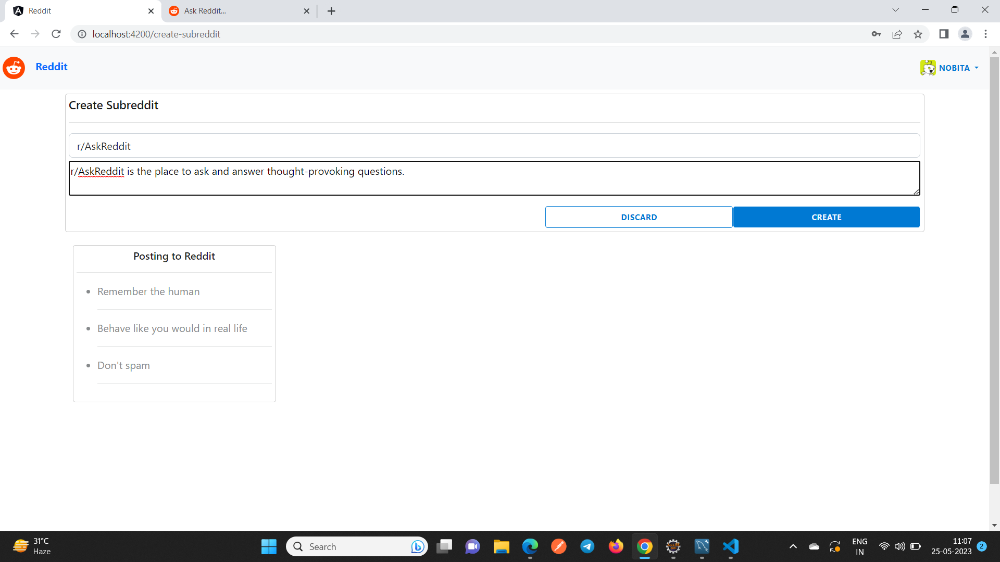

### List Subreddit

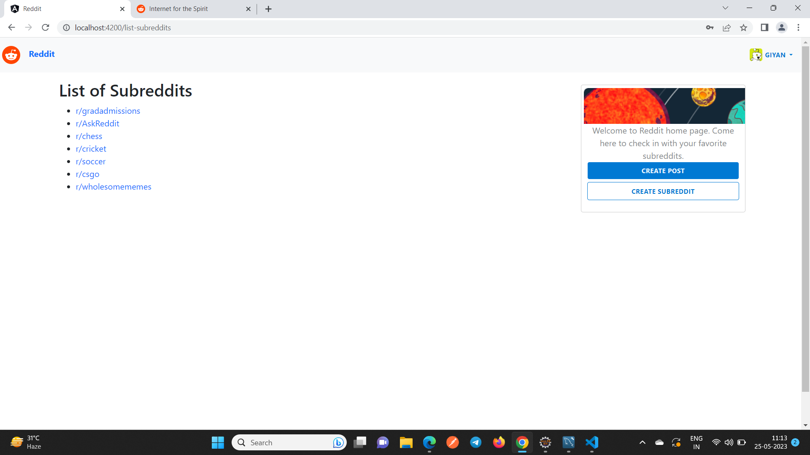

### Create Post

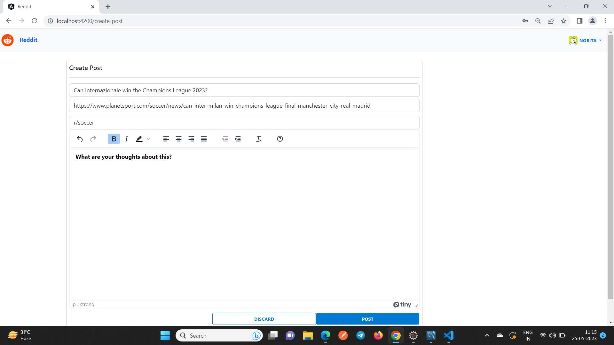

### JWT Auth Token

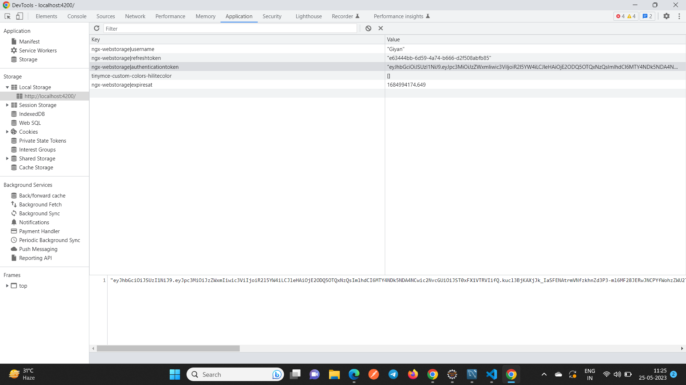

### View Post

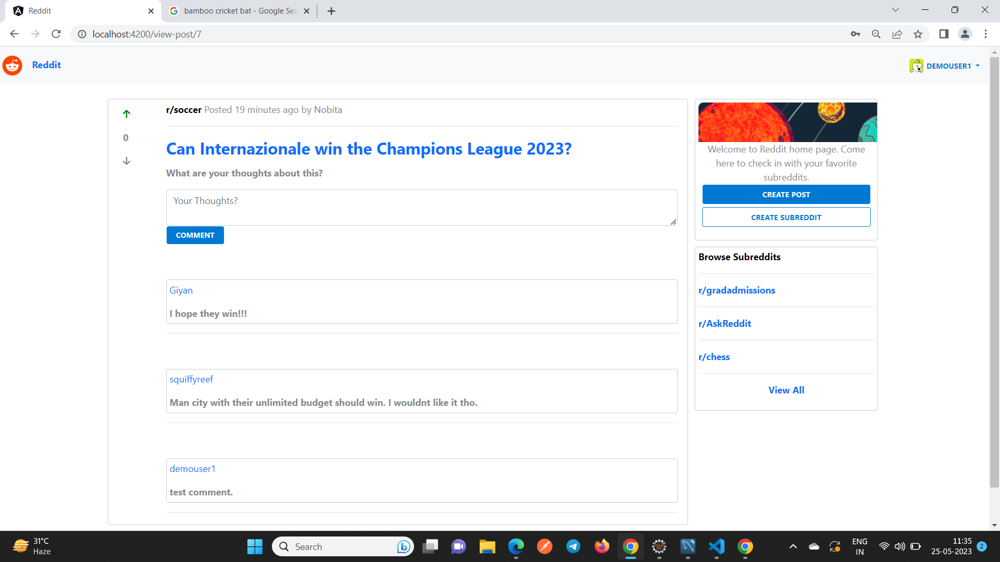

### View User Profile

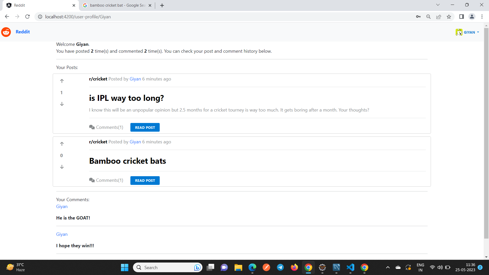

### View Subreddit

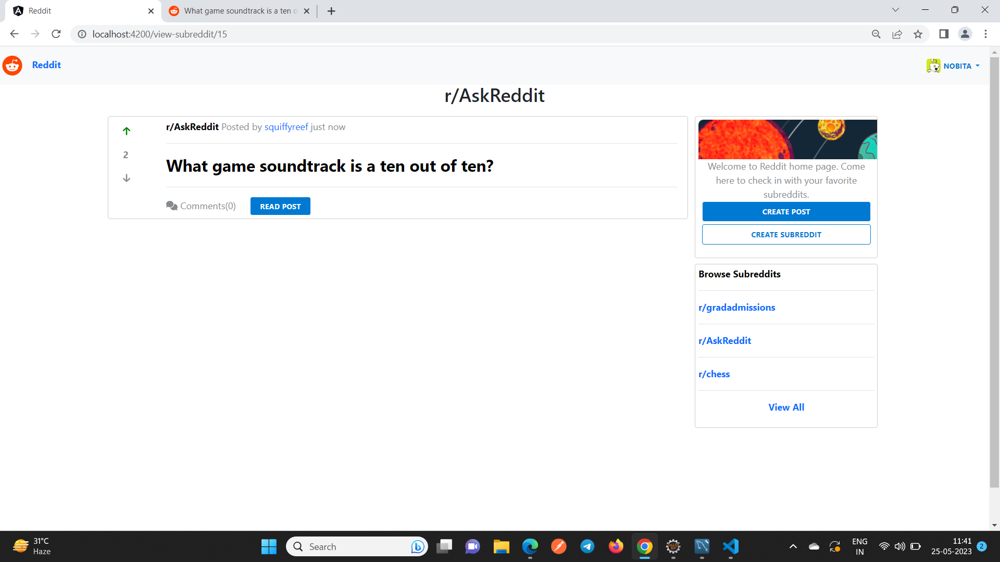
